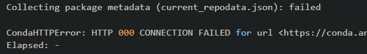
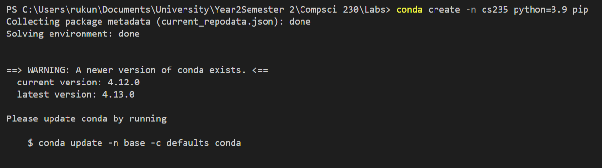
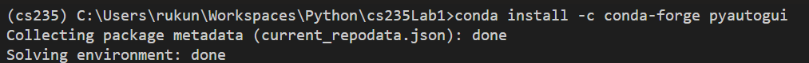
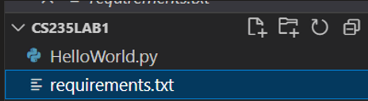
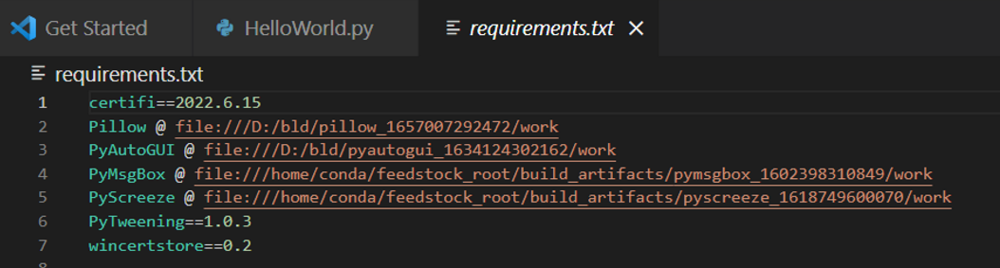
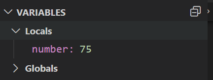
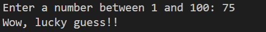

# CS 235 Lab 1 report

## Notes from Lab1

- **The benefits of using virtual environments to develop:**

    - Wo55vrking in distinct environments with their own distinct pacakages and python installation

    - Using virtual environments, we can use different versions of a package.
     
      - This is useful as major versions of software are not ussually backwards compatible.  

    - We can generate a file with all the package requirements easier. 

- **We learnt how to set up a virtual environment using conda- a package and virtual enviroment manager:**

    > Creation of an enviroment: 
            
        conda create -n environmentName python=python_version

    > Activation of an environment: <code></code>
    
        conda activate environmentName

    > Install packages to a virtual enviroment

        conda install -c channelName package1 package2 
    > Deactivation of an environment:

        conda deactivate environmentName
        

- **Miscellaneous**

    - Git is a widely used version controll system. 

        - Github is a hosting platform for repository for collabrative projects. 
    - Markdown is a markup langauge most commonly used to write README.md files git up repositories.
    - The Breakpoint() function in python is useful for debugging; especially with the help of vs codes variable  
  ---
  ## **Reflection**

  **What I learnt:**
        
    - I learnt about how and why one would want to employ a virtual environment to develop code in. 
    - I learnt that conda is a system that allows the creation and management of such virtual environments. 
      - It does this by partitioning a portion of the drive and reserving it for virtualization when the enviroment is active
    
    ## **Hands on tasks:**
    ### 1. Task 1: Create a virtual environment with Conda.
        
    - Encountered an HTTP conncection failure after downloading conda and trying to set up a virtual environment. 
          
      
      <br>
      After some googling, I realized this was attributed to conda's installer not copying some dll files from the Scripts to the Library\bin folder.
      <br>
      After manually copying them over, I was able to create the environment as such:
      <br>
        
      <br/>
   </br>

    ### 2. Installing a package
    - I installed pyauto gui into the environment with no trouble:

          <br>
    ### 3. Generate requirements.txt file   
            
    - Used the command to generate my file with all the necessary packages:
                
            pip freeze requirements.txt
    - All the packages in the virual enviroment were added to the file. 
        
        
    </br>
    ### 4. Debugging questions and exercises: 
     - **Question 1:** What is the probability of winning a game?
            <br>

        **Answer:**
         ```python
        def pickANumber():

        return random.randint(1, 100)
        ``` 
           The probability of winning a game is 1/100 or 0.01 as the pickANumber function, which generates a random number, chooses a number between 1 and 100. This would lead to a 100 possibilities with the chance of us choosing the random number correctly being 1/100. 

    - **Question 2:** Using the debugging feature, WITHOUT changing any code, it is possible to win every game. What line did you insert the breakpoint at? 
       ```python
       def computer_pick_number():
        print(PICK_NUMBER)
        number = pickANumber()
        breakpoint()
        return number
        ``` 
          I added a breakpoint() right after the program generates its random number and before it is returned to the main game function. 
          
          By doing this I was able to view what value for returned to number and guess the same number to guarantee my win every time.
        
        
    
    - **Question 3:** Using the debugging feature only, is it possible the user can win every game by guessing "42"?