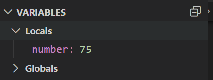
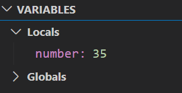
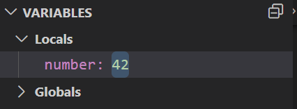
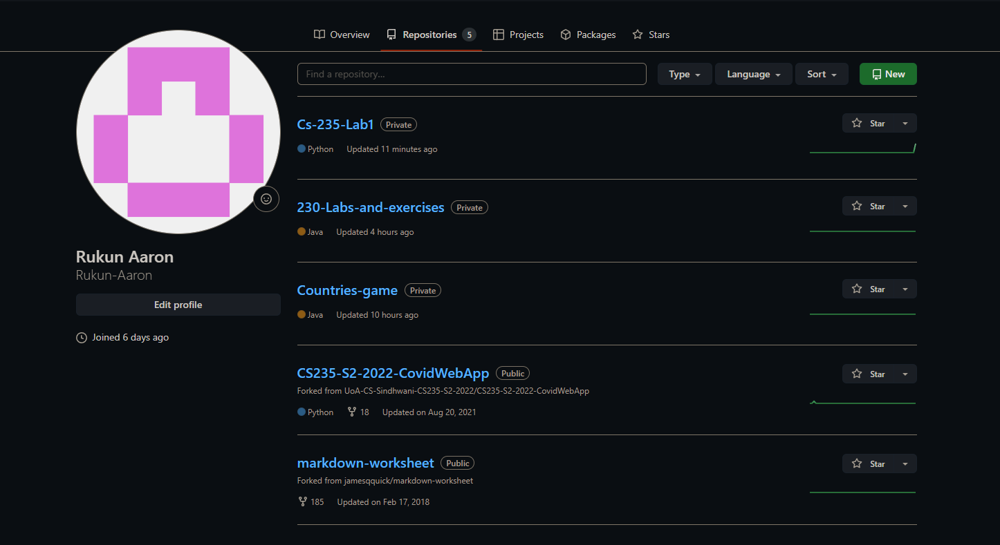

# CS 235 Lab 1 report 
##### Name : Rukun Aaron , Upi = raar518
## Sections

  - [Notes](#notes-from-lab1)
  - [Reflection](#reflection)
  - [Tasks](#4-debugging-questions-and-exercises)
---
## Notes from Lab1

- **The benefits of using virtual environments to develop:**

    - Working in distinct environments with their own distinct pacakages and python installation

    - Using virtual environments, we can use different versions of a package.
     
      - This is useful as major versions of software are not ussually backwards compatible.  

    - We can generate a file with all the package requirements easier. 

- **How to set up a virtual environment using conda- a package and virtual enviroment manager:**

    > Creation of an enviroment: 
            
        conda create -n environmentName python=python_version

    > Activation of an environment: <code></code>
    
        conda activate environmentName

    > Install packages to a virtual enviroment

        conda install -c channelName package1 package2 
    > Deactivation of an environment:

        conda deactivate environmentName
        
- **What is an IDE**
  - IDE stands for integrated development enviroment that consolidates the basic that help enable use to write, run and test code. 
  - Two examples of IDE's used for python are:
    - Visual Studio code by Microsoft.
    - Pycharm for JETbrains 
  - Both these IDE's boast code completion, error checking and debugging capabilities.  
- **What is Debugging**
  - As the name suggests, debugging is the act of finding and rectifying bugs & errors in our code. 
   - The Breakpoint() function in python is useful for debugging; this is because it allows us to halt the program running at the location of where the breakpoint is and lets us see the current state of our variables. 
- **Git & Github**

    - Git is a widely used version controll system. 
      - Using git we are able to create branches and work and many different aspects of the software simultaniously. 
      - We can see the history of our code being altered and revert to previous verions of the software if so need. 
    - Github is a hosting platform for repository for collabrative projects. 
      - Using Github many team members can clone the master branch of the repository onto their local machines, create a new branch, make changes or add featers and merge to back to the master branch. 


- **Markdown**
  - Markdown is a markup langauge most commonly used to write README.md files git up repositories.
   
  ---
  ## **Reflection**

  **What I learnt:**
        
    - I learnt about how and why one would want to employ a virtual environment to develop code in. 
    - I learnt that conda is a system that allows the creation and management of such virtual environments. 
      - It does this by partitioning a portion of the drive and reserving it for virtualization when the enviroment is active
    - I learnt how to generate and download all the packages listed in a file.
    -  I learned how to implement breakpoints to help during debugging and how to manipulate variables with the debugging feature.
    ---

    ## **Hands on tasks:**
    ### 1. Create a virtual environment with Conda.
        
    - Encountered an HTTP conncection failure after downloading conda and trying to set up a virtual environment. 
          
      
      <br>
      After some googling, I realized this was attributed to conda's installer not copying some dll files from the Scripts to the Library\bin folder.
      <br>
      After manually copying them over, I was able to create the environment as such:
      <br>
        
      <br/>
      
      After activating my virtual environment, I made the hellow world folder and manually created a hello world python file:
      
      
   </br>

    ### 2. Installing a package
    - I installed pyauto gui into the environment with no trouble:

          <br>
    ### 3. Generate requirements.txt file   
            
    - Used the command to generate my file with all the necessary packages:
                
            pip freeze requirements.txt
    - All the packages in the virual enviroment were added to the file. 
        
        
    </br>
    ### 4. Debugging questions and exercises: 
     - **Question 1:** What is the probability of winning a game?
            <br>

        **Answer:**
         ```python
        def pickANumber():

        return random.randint(1, 100)
        ``` 
           The probability of winning a game is 1/100 or 0.01 as the pickANumber function, which generates a random number, chooses a number between 1 and 100. This would lead to a 100 possibilities with the chance of us choosing the random number correctly being 1/100. 

    - **Question 2:** Using the debugging feature, WITHOUT changing any code, it is possible to win every game. What line did you insert the breakpoint at? 
       ```python
       def computer_pick_number():
        print(PICK_NUMBER)
        number = pickANumber()
        breakpoint()
        return number
        ``` 
          I added a breakpoint() right after the program generates its random number and before it is returned to the main game function. 
          
          By doing this I was able to view what value for returned to number and guess the same number to guarantee my win every time.
        
        
    
    - **Question 3:** Using the debugging feature only, is it possible the user can win every game by guessing "42"?

        By using the same breakpoint(): 
        ```python
        def computer_pick_number():
        print(PICK_NUMBER)
        number = pickANumber()
        breakpoint()
        return number
        ```
        I am able to edit the value of number before it is returned to the game function. 
        
        
        
            
          I was able to overwrite the random number to 42 due the breakpoint() stopping the code just before the number was returned. 
          Hence  we can always win by guessing 42, by overwriting the random number we have to guess. 
    ### 5. [My Github Account](https://github.com/Rukun-Aaron)
    I went online and created a github account using my university email
    The user name is [Rukun-Aaron](https://github.com/Rukun-Aaron).
    
---
